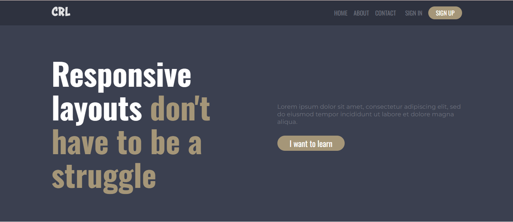
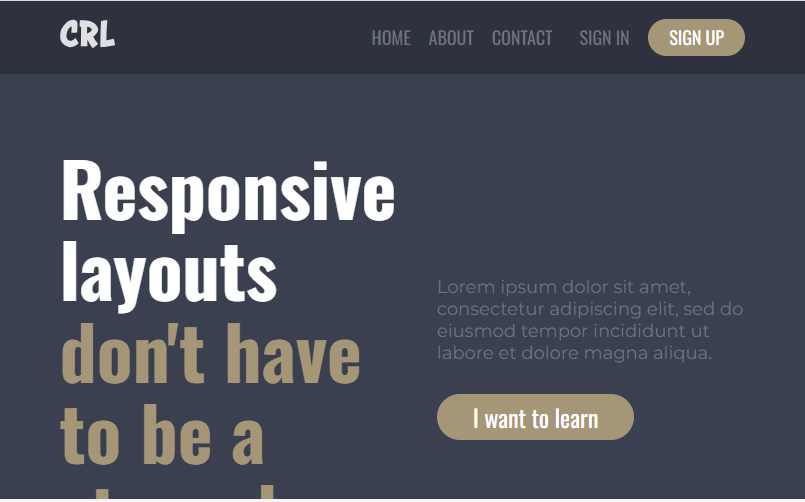
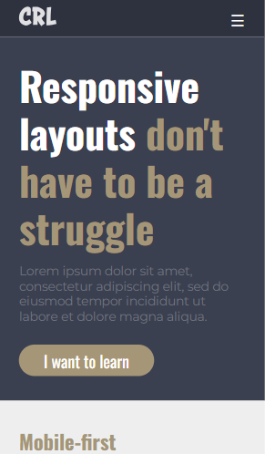

# Responsive Navigation Website

A modern, fully responsive website with a **mobile-first** design approach.  
This project demonstrates clean HTML, CSS, and JavaScript to create a layout that adapts seamlessly across devices, featuring a responsive navigation menu, hero section, and well-structured content areas.

---

## 🚀 Features

- **Responsive Navigation Menu** with mobile hamburger toggle
- **Mobile-first** design approach
- Flexible **grid & flexbox layout**
- **Semantic HTML structure** for better accessibility
- Styled with **custom fonts** (`Oswald` and `Montserrat`)
- Smooth **hover effects** and **button styling**
- Fully responsive footer with multiple link sections

---

## 📸 Screenshots

### Desktop View

### Tablet View

### Mobile View

---

## 🛠️ Tech Stack

- **HTML5**
- **CSS3** (Flexbox, Responsive Media Queries)
- **JavaScript** (for mobile menu toggle)
- **Google Fonts** (`Oswald`, `Montserrat`)

---

## 📂 Folder Structure

responsive-navigation/
│── index.html
│── style.css
│── script.js
│── images/
│ ├── logo.svg
│ ├── finalist Challenge.jpg
│── screenshots/
│ ├── desktop-view.png
│ ├── tablet-view.png
│ ├── mobile-view.png
